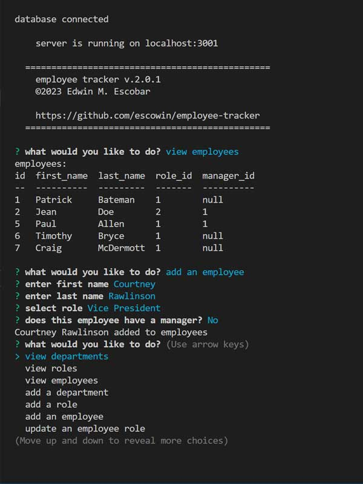

# employee-tracker

## Description
[Repo](https://github.com/escowin/employee-tracker)


using crud operators with sql queries through the command line

## Table of Contents
- [Installation](#installation)
- [Test](#test)
- [Code](#code)
- [Screenshots](#screenshots)
- [Author](#author)

## Installation
Run the following command to install necessary dependencies:
```
$ npm i;
```

## Test
Run the following command to run tests:
```
n/a
```

## Code
- Languages: Javascript, SQL
- Frameworks: Node, Express
- Libraries: inquirer, mysql2, dotenv, console.table
- Database: mySQL

## Screenshots


## Author
### Edwin M. Escobar
- [Email](mailto:edwin@escowinart.com)
- [GitHub](https://github.com/escowin)
